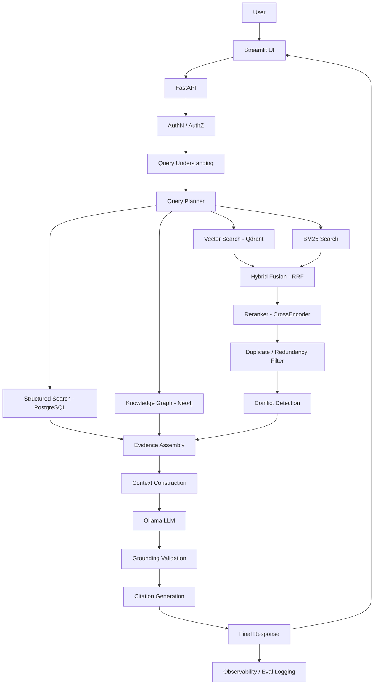
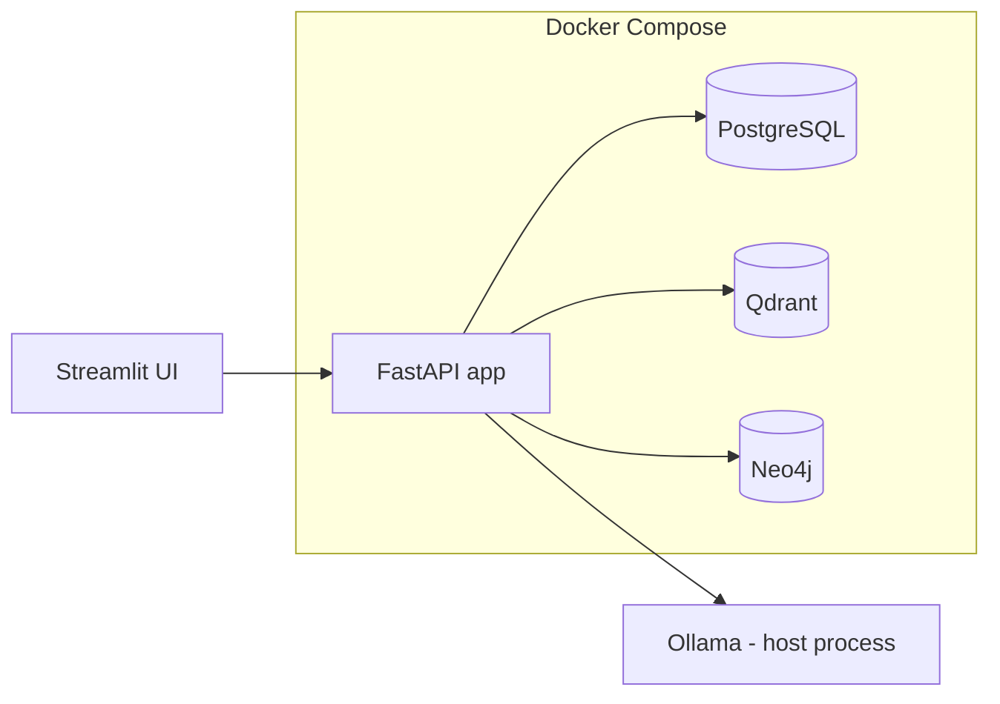

# Architecture — Enterprise RAG + Knowledge Graph Platform

## 1. What this system is

A local-first platform that lets an organization ask natural-language questions
over heterogeneous enterprise data (documents, employee records, projects,
policies) and get an answer that is:

- grounded in retrieved evidence (never fabricated),
- cited back to specific documents/sections,
- filtered by the asking user's authorization,
- explicit about missing or conflicting evidence.

It combines four retrieval modalities — vector search, BM25, a Neo4j knowledge
graph, and PostgreSQL structured queries — behind one query planner, then
reranks and validates before generation.

## 2. Why this architecture (not "LangChain does it")

The retrieval pipeline (chunking → embedding → indexing → hybrid search →
rerank → context construction) is hand-built in `app/services/*` so every
stage is inspectable and swappable. Frameworks (if any) are added only where
they remove real boilerplate (e.g. SQLAlchemy for the ORM layer), never as a
black box wrapping retrieval or generation.

## 3. Request flow

## 4. Components and where they live

| Component | Tech | Location |
|---|---|---|
| API | FastAPI, Pydantic, Uvicorn | `app/api`, `app/main.py` |
| Config | pydantic-settings, `.env` | `app/config` |
| Auth | RBAC abstraction (pluggable backend) | `app/core/security`, `app/services/security` |
| Ingestion | PyMuPDF, python-docx, pandas, openpyxl | `app/services/ingestion` |
| Chunking | custom, strategy pattern | `app/services/ingestion/chunking.py` |
| Embeddings | sentence-transformers | `app/services/embeddings` |
| Vector store | Qdrant (Docker) | `app/services/retrieval/vector.py` |
| Lexical search | rank-bm25 | `app/services/retrieval/bm25.py` |
| Fusion | Reciprocal Rank Fusion | `app/services/retrieval/fusion.py` |
| Reranking | HF CrossEncoder | `app/services/reranking` |
| Knowledge graph | Neo4j Community, Cypher | `app/services/graph` |
| Structured data | PostgreSQL, SQLAlchemy/SQLModel, Alembic | `app/repositories`, `migrations` |
| Query understanding/planning | Pydantic schemas + LLM-assisted parsing | `app/services/generation/query_understanding.py`, `app/pipelines` |
| Generation | Ollama (configurable model) | `app/services/generation` |
| Evaluation | custom harness + optional LLM-judge | `app/services/evaluation`, `evaluation/` |
| Observability | structlog JSON logs, request IDs; OTel/Prometheus later | `app/core/observability` |
| UI | Streamlit | `frontend/` |
| Doc generation (CVs) | python-docx, ReportLab | `app/services/documents` |

## 5. Deployment topology (local dev)

Ollama runs on the host (Windows) rather than in Compose, because GPU
passthrough for containerized Ollama on Windows/Docker Desktop is
unreliable. The app talks to it over Ollama's OpenAI-compatible API (see
ADR 0005) via `OPENAI_BASE_URL` (default
`http://host.docker.internal:11434/v1` from inside a container).

## 6. Key architectural risks

1. **Local LLM quality/latency** — small local models (7-8B) may struggle
   with multi-entity query decomposition and strict grounding instructions.
   Mitigation: keep query understanding schema-constrained (Pydantic
   validation + retry), don't rely on the LLM for anything that structured
   parsing/rules can do more reliably.
2. **Graph/vector/SQL fan-out latency** — four backends queried per complex
   question. Mitigation: query planner skips unnecessary retrievers; async
   fan-out with `asyncio.gather`.
3. **Entity resolution correctness** — free-text employee/company/project
   names ingested from documents may not match graph nodes exactly.
   Mitigation: normalized entity keys + fuzzy-match resolution step with an
   audit trail, never silent auto-merge above a similarity floor.
4. **Windows + Docker Desktop** — some enterprise Docker patterns (host
   networking, GPU passthrough) behave differently on Windows. All Compose
   services are addressed by service name; Ollama is the one exception
   (host process) documented above.
5. **Scope** — this spec is enormous (50 sections). Built in phases per
   `docs/implementation-status.md`; each phase must be independently working
   and tested before the next starts.

## 7. Evolution path

See `docs/deployment.md` for the local → single-server → internal → scalable
production progression.
